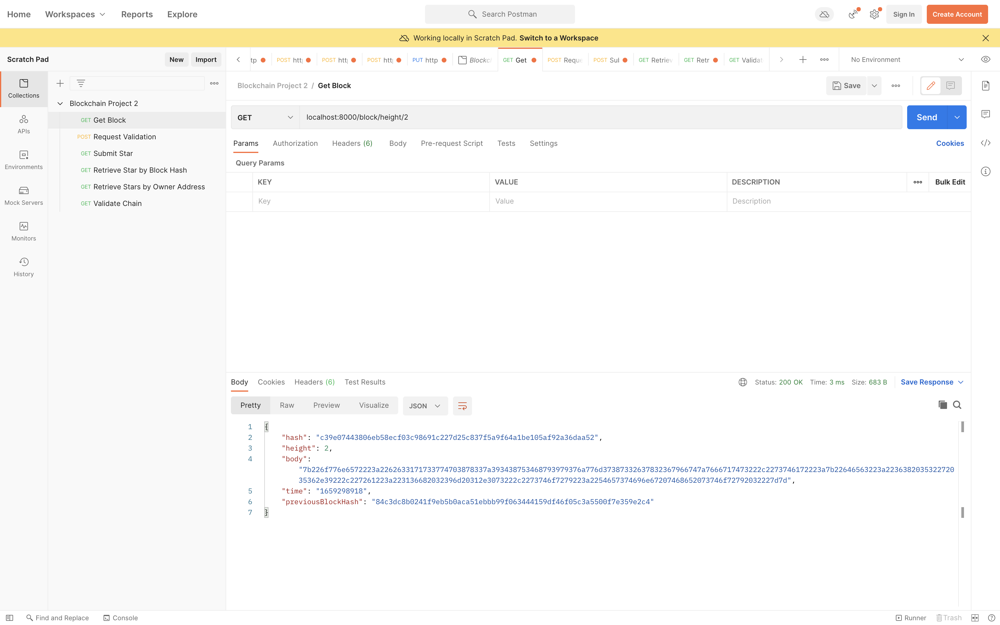
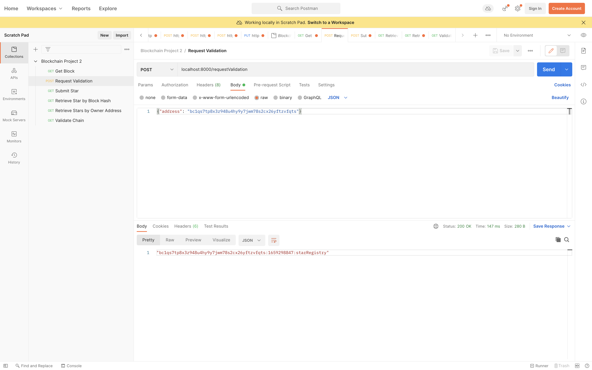
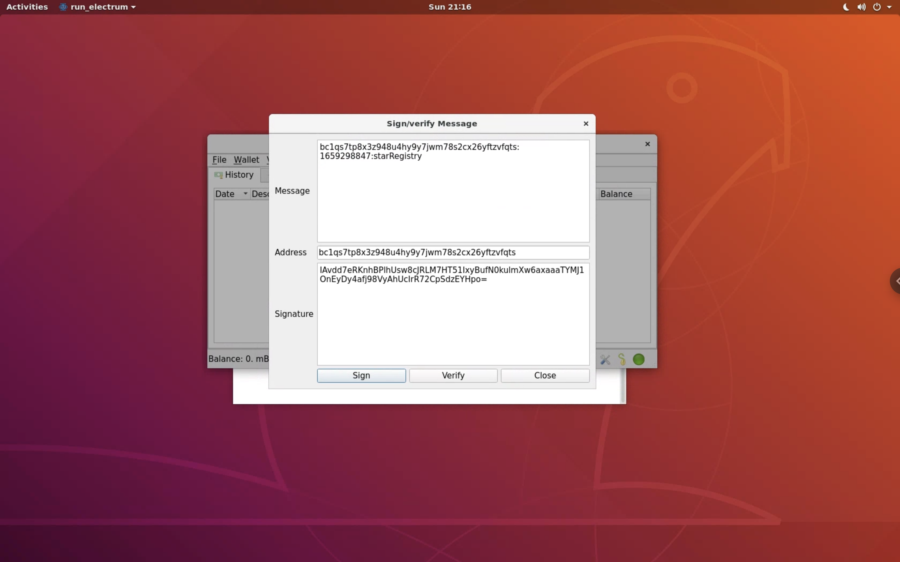
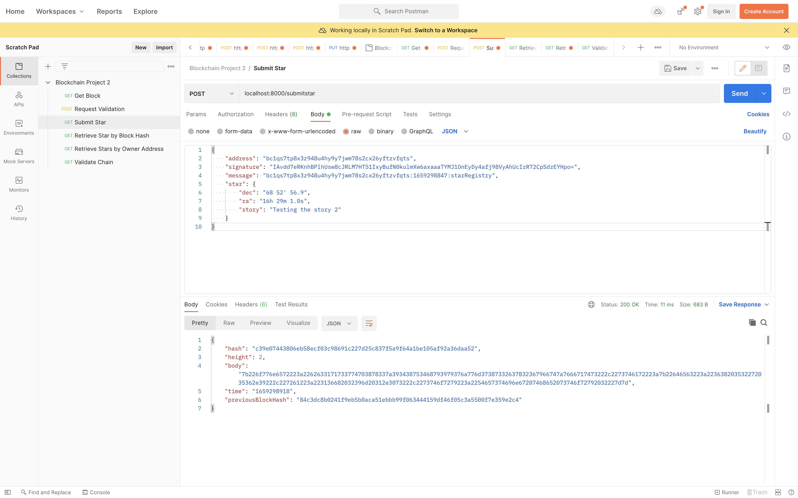
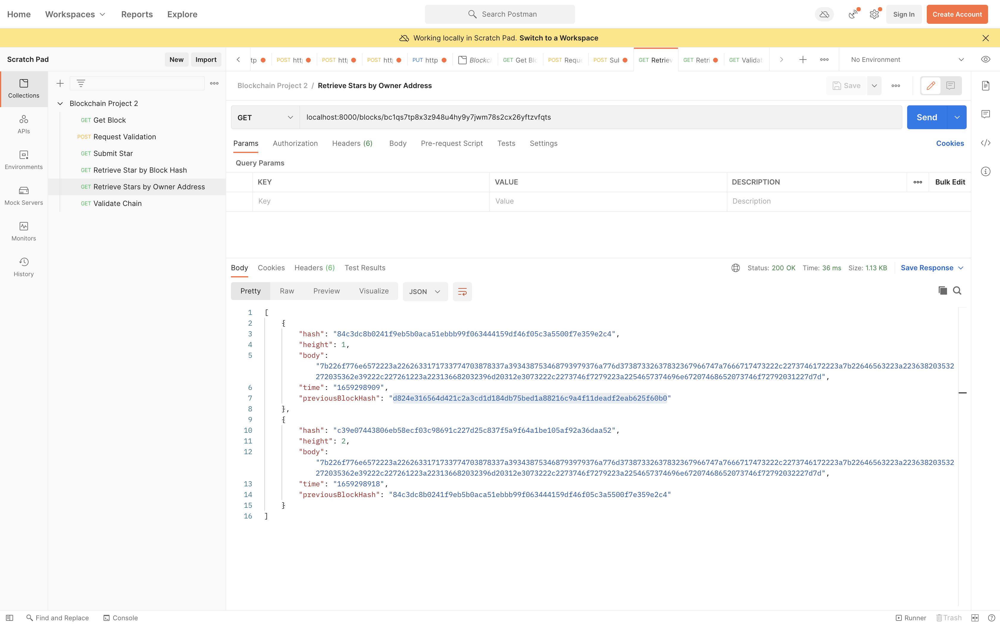
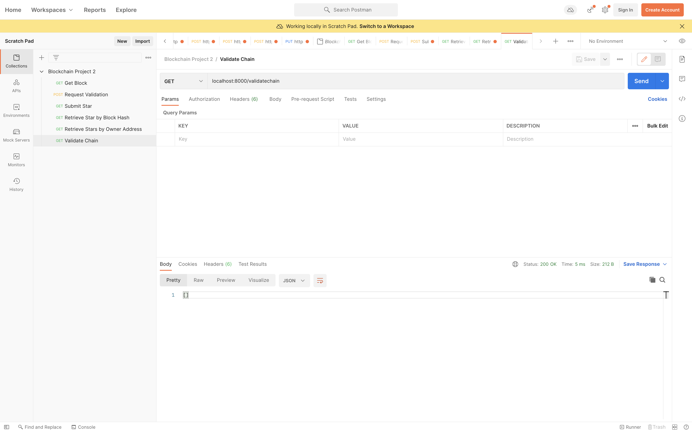

# Private Blockchain Application

Project Submission for Udacity's Blockchain Developer Nanodegree. See [Project Readme](./Project-ReadMe.md) for more information.

## Getting Started

```
npm install
node app.js
```
Note: Project Boiler Plate provided only works with Node v10.

## Changes made to the boiler plate project code 
These are additional changes made to the boiler plate code outside of the changes highlighted in the project guidelines.

- Updated the `bitcoinjs-message` library from `^2.0.0` to `^2.2.0` to support segwit signature from electrum. [See](https://github.com/bitcoinjs/bitcoinjs-message#about-electrum-segwit-signature-support)


## Changes made to complete the boiler plate code for the project

Specification for the changes can be found in the [Project Rubrics](https://review.udacity.com/#!/rubrics/2546/view)

1. `block.js` file, In the `Block` implemented the following methods `validate()` and `getBData()`.
2. `blockchain.js` file. In the `Blockchain` class, implemented the following method:
    `_addBlock(block)`, 
    `requestMessageOwnershipVerification(address)`,
    `submitStar(address, message, signature, star)`,
    `getBlockByHash(hash)`,
    `getStarsByWalletAddress (address)`,
    `validateChain()`,
3. `BlockchainController.js` file, In the `BlockchainController` class, implemented the `triggerChainValidation`


## How to test your application functionalities?

To test the application I have used POSTMAN as recommended in the project guideline.

1. Run your application using the command `node app.js`
You should see in your terminal a message indicating that the server is listening in port 8000:
> Server Listening for port: 8000

2. Get Block by height:
    
3. Make your first request of ownership sending your wallet address:
    
4. Sign the message with your Wallet:
    
5. Submit your Star
     
6. Retrieve Stars owned by me
    
6. Trigger Chain Validation
    